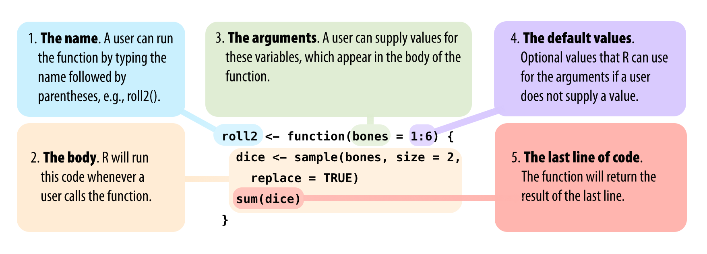

```{r setup, include=FALSE}
knitr::opts_chunk$set(eval = FALSE)
```

# Functions

## Why to write functions

In this example, I want to know the standard error of the mean ($SE = \frac{\sigma}{\sqrt{n}}$) of several random variables: 

```{r}
# create a data frame with random numbers
df <- data.frame(
  a = rnorm(10),
  b = rnorm(10),
  c = rnorm(10),
  d = rnorm(10)
)
df

# Calculate standard error of the mean for each variable
sem_a <- sd(df$a)/sqrt(length(df$a))
sem_b <- sd(df$b)/sqrt(length(df$b))
sem_c <- sd(df$c)/sqrt(length(df$a))
sem_d <- sd(df$d)/sqrt(length(df$d))
```

* Automate common tasks instead of copying and pasting
* Code is easier to understand 
* Reduces risk of making mistakes 
* Less code, function can be stored in external script
* If you want to change something, you only have to change it once

## When to write functions

"Consider writing a function whenever you've copied and pasted a block of code more than twice." (Wickham and Grolemund: R for data science)

## How to write functions

### Elements of a function



```{r}
function_name <- function(argument1, argument2){
  #Body: What the function does
  argument1 + argument2
}
function_name(1, 1)
```


```{r}
# Write function for standard error of the mean
sem <- function(x){
  sd(x)/sqrt(length(x))
}

# calculate standard error of the mean with function
sem(df$a)
sem(df$b)
sem(df$c)
sem(df$d)
```

### Default arguments

```{r}
textprinter <- function(text = "Hello world!"){print(text)}
textprinter("Some random text")
textprinter()
```

### A more complicated example

```{r}
lm_output <- function(x, y, xlabel, ylabel){
  # bind both vectors to data frame
  dat <- data.frame(a = x, b = y)
  # fit linear regression
  mod <- lm(b ~ a, data = dat)
  # show summary
  print(broom::tidy(mod))
  # get p value
  p <- broom::tidy(mod)[2,5]
  # plot
  if(p > 0.05){
    # if the relationship is not significant, without trendline
    ggplot(dat, aes(a, b)) +
      geom_point() +
      labs(x = xlabel, y = ylabel)
  }else{
    # if the relationship is significant, with trendline
    ggplot(dat, aes(a, b)) +
      geom_point() +
      geom_smooth(method = "lm") +
      labs(x = xlabel, y = ylabel)
  }
}

# axis labels
xlab <- "This is the x axis"
ylab <- "This is the y axis"

# data where y depends on x
x1 <- runif(100, 0, 30)
y1 <- x1*2 + 10 + rnorm(100, 0, 10)
lm_output(x1, y1, xlab, ylab)

# independent data
x2 <- runif(100, 0, 30)
y2 <- runif(100, 0, 30)
lm_output(x2, y2, xlab, ylab)
```


### Best practice

* Choose meaningful names in a consistent style
* Don't overwrite existing functions
* First build code that works with one object, than transform it into a function
* Save your functions in another script that you call with `source("script_with_my_functions.R")`


# For loops

## How to build a for loop

```{r}
# Elements of a for loop:
output <- vector(mode, length) # prepare an empty object 
for (i in sequence){           # calling this placeholder "i" is just a convention, you could also 
                               # use another name
  #Body: what the loop does
}

# For loop that calculates the standard error of the mean for all columns of the example data frame
# prepare output
loop_output <- vector(mode = "double", length = ncol(df))
#for loop
for (i in 1:ncol(df)){
  loop_output[[i]] <- sd(df[[i]])/sqrt(length(df[[i]]))
}
# inspect output
loop_output

# The same loop, but using our sem() function
for (i in 1:ncol(df)){
  loop_output[[i]] <- sem(df[[1]])
}

```

* Creating the empty output object beforehand makes the loop more efficient
* "i in 1:..." is a sequence (in this case, i in 1 to 4), indicating that the steps in the loop body should be conducted for all numbers in the sequence
* df[[i]] is the i-th column of df, loop_output[[i]] the i-th number in loop_output


# The apply and map functions

Functions with which you can use a function repeatedly

## The map family

* Package `purrr` (part of the tidyverse)
* Which function to use depends on the kind of output you want
* map() returns a list
* map_lgl(), map_int(), map_dbl() and map_chr return a vector of the indicated type
* map_dfr and map_dfc return a data frame created by row-binding and column-binding respectively

```{r}
library(tidyverse)

# get standard error of the mean for all columns of the data frame
map_dbl(df, sem)
```


## apply or map family?

* Base R: apply family with functions like apply(), mapply(), sapply(), lapply(), tapply() etc.
* Does same job as map family, but more difficult to understand which output class you get


# Loops vs. apply/map & Co.

* Loops have a reputation of being very slow, but today they are not (if you prepare an empty output object)
* Functions like map() and apply() are shorter and easier to read than loops


# Literature

[Wickham and Grolemund: R for data science](https://r4ds.had.co.nz/index.html) (Chapters 19 and 21)
[Grolemund: Hands-on programming with R](https://rstudio-education.github.io/hopr/) (Chapters 2.4 and 11)